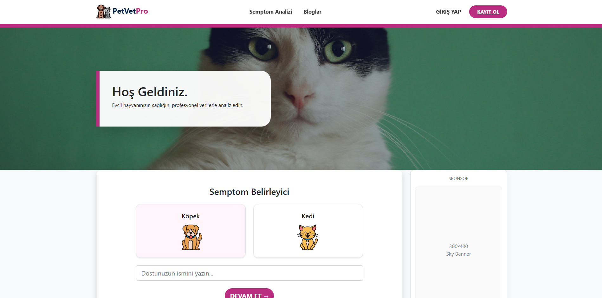
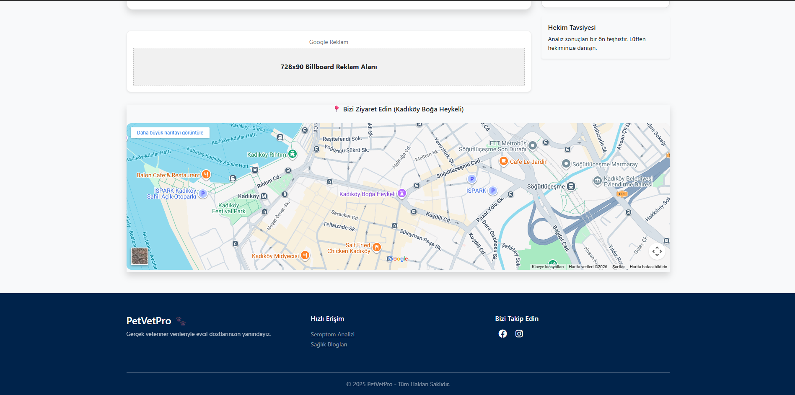
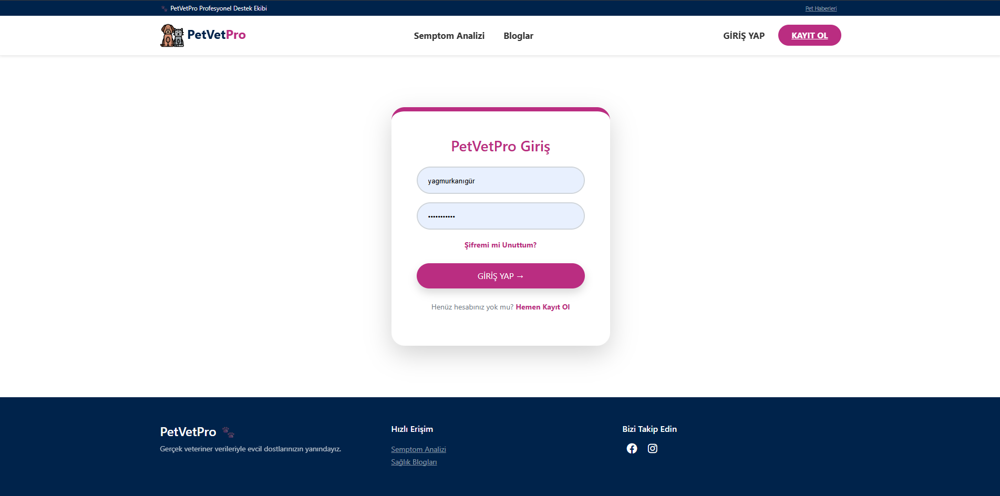
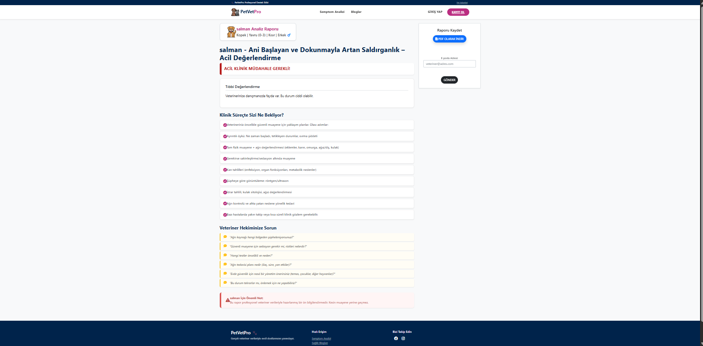
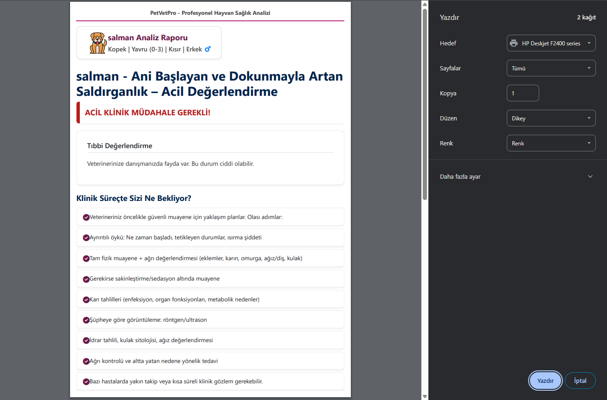
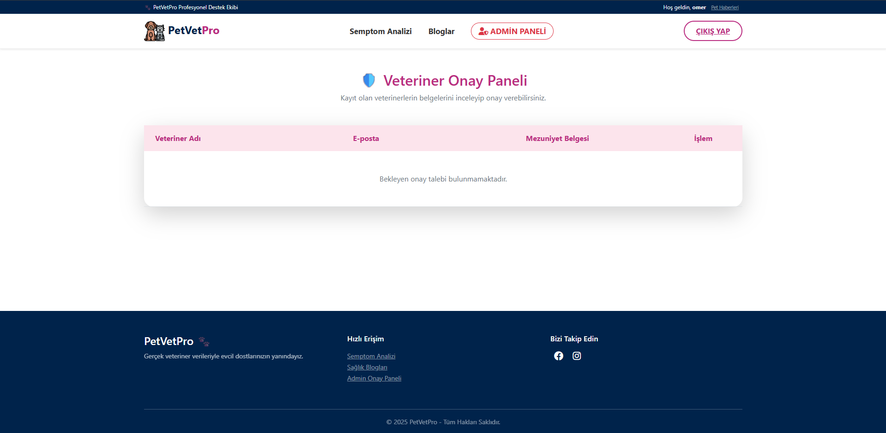
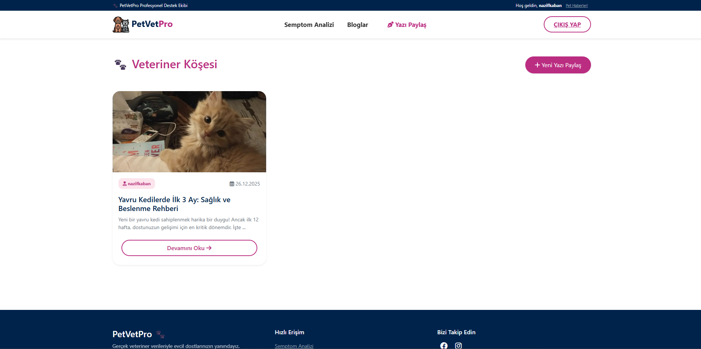
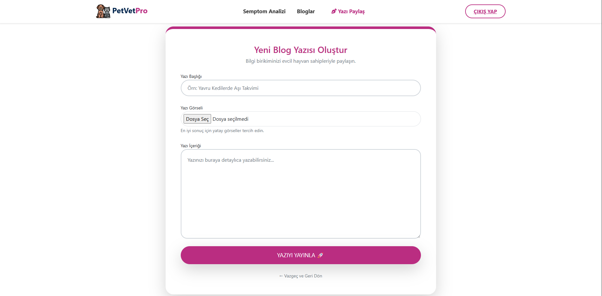
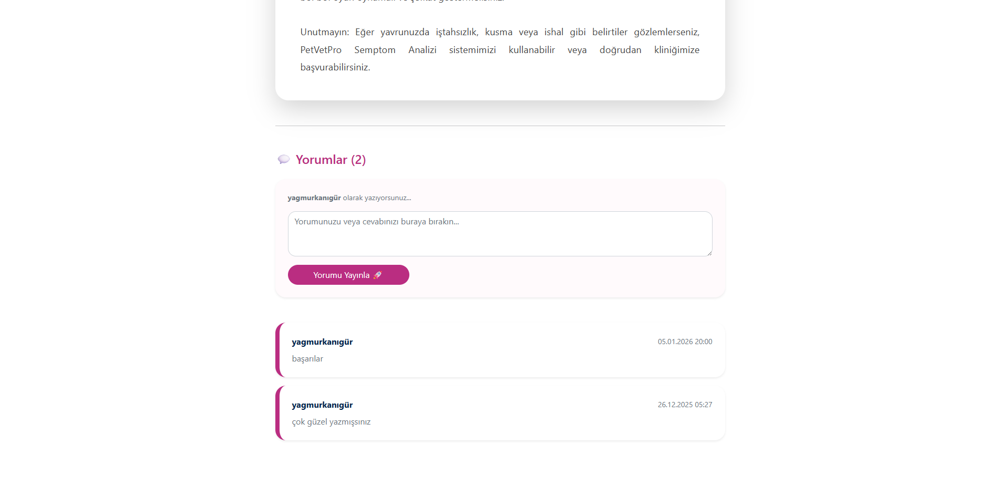

🐾 PetVetPro – ASP.NET Tabanlı Evcil Hayvan Sağlık Analiz Platformu

PetVetPro, **ASP.NET MVC** altyapısı ile geliştirilmiş; evcil hayvan sahipleri ve veteriner hekimler için tasarlanmış **kapsamlı bir sağlık analiz, raporlama ve bilgilendirme web uygulamasıdır**.

---

🎯 Projenin Amacı

Evcil hayvan sahiplerinin kedi ve köpeklerinde gözlemledikleri belirtileri sistematik şekilde analiz ederek:

- Hastalığın **acil olup olmadığını** belirlemek  
- Veteriner hekime **ön değerlendirme raporu** sunmak  
- Yanlış bilgi ve panik riskini azaltmak  
- Klinik süreci hızlandırmak  

---

🛠️ Kullanılan Teknolojiler

- ASP.NET MVC  
- C#  
- Entity Framework  
- SQL Server  
- HTML5 / CSS3 / Bootstrap  
- JavaScript  
- PDF Export  
- SMTP (E-posta bildirimleri)  

---

🏠 Ana Sayfa

- Kedi / Köpek seçimi  
- Semptom analizine hızlı yönlendirme  
- Bilgilendirme ve sponsor alanları  
- Google Maps entegrasyonu (klinik konum)  

---

👤 Giriş & Kullanıcı Sistemi

- Kullanıcı kayıt ve giriş işlemleri  
- **Şifremi Unuttum** özelliği:
  - Kullanıcının e-posta adresine bildirim gönderilir  
- Oturum ve rol bazlı yetkilendirme  

---

🔍 Semptom Analizi Sistemi

- Toplam **20 farklı belirti seçimi**  
- **60+ farklı analiz / rapor altyapısı**  
- Tür bazlı değerlendirme:
  - 🐶 Köpek
  - 🐱 Kedi
- Seçilen belirtilere göre:
  - **Özel 3 yönlendirici klinik soru**
- Sonuç sınıflandırması:
  - 🟢 Normal
  - 🟡 Takip Gerektirir
  - 🔴 **Acil Klinik Müdahale Gerekli**

---

📄 PDF Rapor Oluşturma

- Analiz sonucuna göre **detaylı sağlık raporu**
- Veteriner için hazırlanmış klinik süreç önerileri
- Tek tıkla:
  - PDF oluşturma
  - Yazdırma
  - E-posta ile gönderme

---

🩺 Veteriner Yetkilendirme & Admin Paneli

- Veterinerler sisteme kayıt olabilir ancak:
  - **Doğrudan aktif olamaz**
- Admin tarafından:
  - Mezuniyet belgesi incelenir
  - Onay / Red işlemi yapılır
- **Sadece onaylanan veterinerler**:
  - Blog yazısı paylaşabilir

---

✍️ Blog & Veteriner Köşesi

- Blog yazma yetkisi yalnızca **onaylı veterinerlerde**
- Blog özellikleri:
  - Görsel ekleme
  - İçerik oluşturma
  - Yayınlama
- Kullanıcılar:
  - Blogları okuyabilir
  - Yorum yapabilir

---

💬 Yorum Sistemi

- Giriş yapan kullanıcılar yorum yapabilir
- Yorumlar:
  - Kullanıcı adı
  - Tarih
  - İçerik bilgisi ile listelenir

---

📍 Harita Entegrasyonu

- Google Maps entegrasyonu
- Klinik / ziyaret noktası gösterimi

---

🔐 Güvenlik & Yetkilendirme

- Rol bazlı yetkilendirme:
  - Kullanıcı
  - Veteriner
  - Admin
- Yetkisiz erişimlerin engellenmesi

---

👨‍💻 Geliştirici

**Ömer Faruk Sarıkaya**  
Bilgisayar Mühendisliği Öğrencisi

---

⚠️ **Not:**  
Bu sistem bilgilendirme amaçlıdır. Kesin teşhis yerine geçmez.  
Mutlaka veteriner hekime danışılmalıdır.

